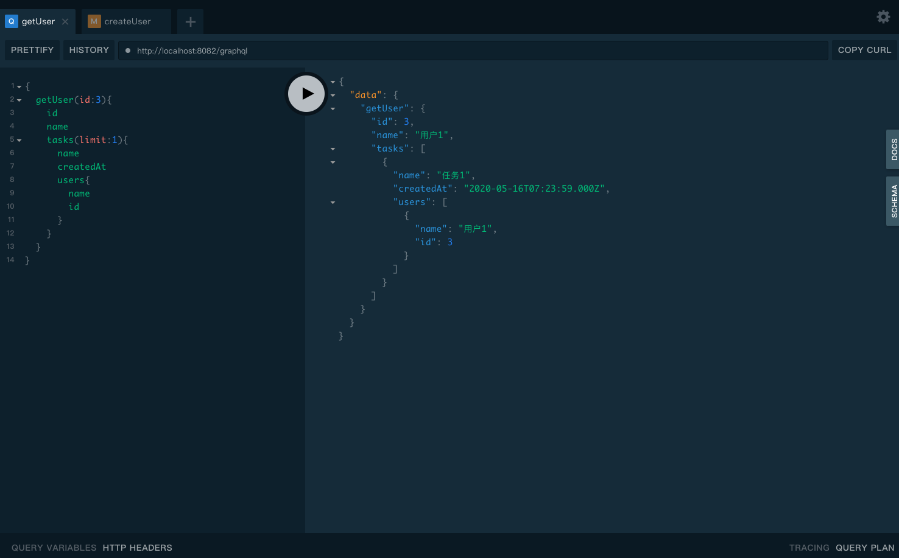
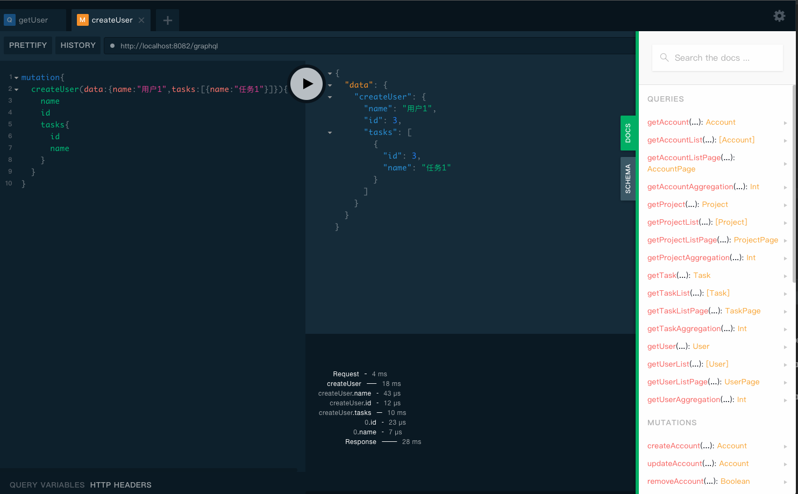
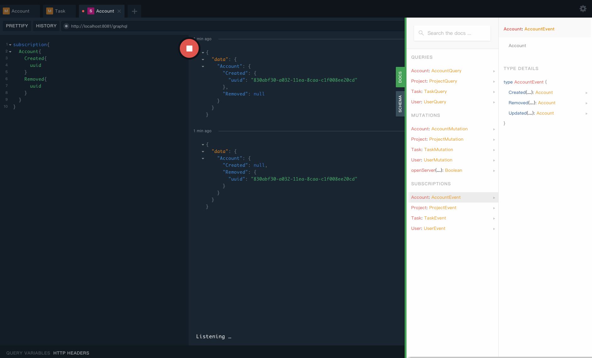

# graphql-adapter 
# graphql schema 自动生成器

## 安装
```bash
$ yarn add graphql-adapter // or npm i graphql-adapter --save
```

## 原理
根据`orm`([sequelize](https://github.com/sequelize/sequelize))框架自动解析框架`model`的属性，添加基于`model`crud的graphql接口
## 简单用法
```js
const http = require("http");
const {ApolloServer, PubSub} = require("apollo-server-express");
const express = require("express");
const {generateSchema} = require("../dist");
const {Sequelize, DataTypes} = require("sequelize");
const sequelize = new Sequelize({dialect: "mysql"});
const models = {
  user: sequelize.define("user", {name: DataTypes.STRING})
};
const server = new ApolloServer({
  schema: generateSchema(models, {pubSub: new PubSub()}),
});
const app = express();
server.applyMiddleware({app});
const httpServer = http.createServer(app);
server.installSubscriptionHandlers(httpServer);
const PORT = 8082;
httpServer.listen(PORT, () => {
  console.log(`🚀 Server ready at http://localhost:${PORT}${server.graphqlPath}`);
  console.log(`🚀 Subscriptions ready at ws://localhost:${PORT}${server.subscriptionsPath}`);
});

```
## 高级用法
```js
const http = require("http");
const {ApolloServer, PubSub} = require("apollo-server-express");
const express = require("express");
const {generateSchema} = require("../dist");
const {sequelize, models} = require("./db");
sequelize.sync();
const server = new ApolloServer({
  schema: generateSchema(models, {
    pubSub: new PubSub(),
    handlerFindOptions: ((action, options) => {
      console.log("action", action, options);
      return options;
    }),
    handlerAggregateOptions: ((action, options) => {
      console.log("action", action, options);
      return options;
    }),
    filterSubscription: (response) => {
      console.log("Subscription", response);
      return true;
    },
    created: {
      filter: (response) => {
        console.log("created.filter", response);
        return true;
      }
    },
    configMap: {
      User: {
        created: {
          filter: (response) => {
            console.log("User.created.filter", response);
            return true;
          }
        },
      }
    }
  }),
  tracing: true,
});
const app = express();
server.applyMiddleware({app, path: "/graphql"});
const httpServer = http.createServer(app);
server.installSubscriptionHandlers(httpServer);
const PORT = 8082;
httpServer.listen(PORT, () => {
  console.log(`🚀 Server ready at http://localhost:${PORT}${server.graphqlPath}`);
  console.log(`🚀 Subscriptions ready at ws://localhost:${PORT}${server.subscriptionsPath}`);
});

```
## 实现接口
### query(查询)
- get(查找单个)
- getlist(查找列表)
- getlistpage(查找)
- getaggregation

### mutation(异变)
- create(新建)
- remove(删除)
- update(更新)

### subscription(监听)
- created(新建事件)
- removed(删除事件)
- updated(更新事件)


